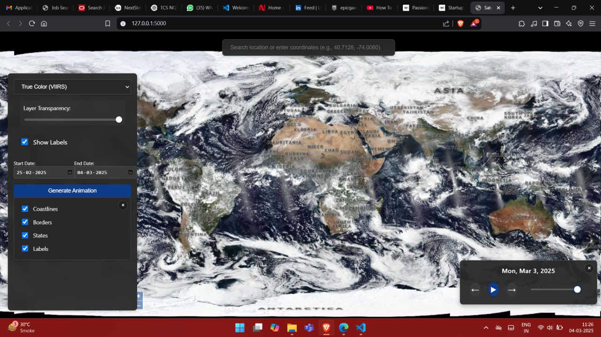

# Satellite Image Interpolation

An interactive web application for visualizing and creating smooth animations from satellite imagery using advanced frame interpolation techniques.

## Features

- **Real-time Satellite Imagery**: View current and historical satellite data from multiple sources
  - VIIRS SNPP True Color
  - MODIS Aqua True Color
  - MODIS Terra True Color
  - VIIRS NOAA-20 True Color
  - VIIRS NOAA-21 True Color

- **Interactive Map Controls**
  - Layer selection for different satellite sources
  - Toggle reference layers (coastlines, borders, labels)
  - Temporal navigation with date slider
  - Play/pause animation controls
  - Step-by-step navigation

- **Advanced Animation Generation**
  - Frame interpolation using RIFE neural network
  - Smooth transitions between satellite images
  - Customizable frame rate and quality settings
  - Video export functionality

## Technical Details

### Architecture

- **Frontend**: HTML5, JavaScript, OpenLayers
- **Backend**: Python Flask
- **Image Processing**: OpenCV, NumPy
- **Frame Interpolation**: RIFE Neural Network

### Key Components

- `WMSImageFetcher`: Handles satellite imagery retrieval from WMS servers
- `RIFEInterpolator`: Implements advanced frame interpolation using the RIFE model
- `FrameInterpolator`: Provides basic frame interpolation capabilities

## Dependencies

- Python 3.7+
- OpenCV
- NumPy
- PyTorch
- Flask
- OpenLayers
- OWSLib

## Acknowledgments

- NASA GIBS for providing satellite imagery
- RIFE (Real-Time Intermediate Flow Estimation) for the frame interpolation model
- OpenLayers for the mapping interface

## Screenshots

  

## Contact

Prithvi Marwadi - [@prithveei](https://x.com/prithveei) - prithvimarwadiwork@gmail.com
